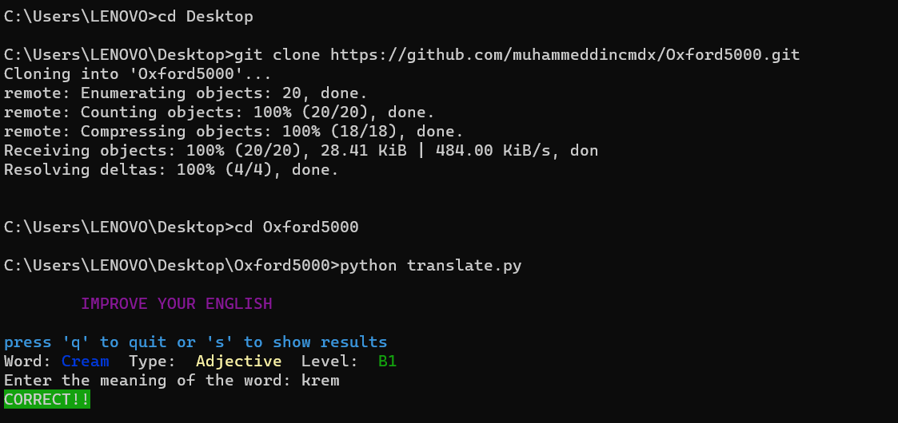
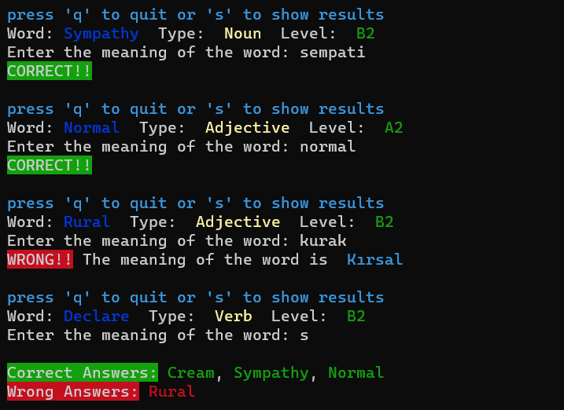

# 5000 Kelime Türkçe İngilizce Çeviri Programı 

#### Not: Bu repositorynin oluşturulmasında kaynak olarak kullanılan reposityory: https://github.com/dceyy/oxford5000

#### Not: In the below there is english explanation for this project.

Projenin Temel Özellikleri
---

* dceyy tarafından hazırlanan kod örneğinde program oxford tarafından yaygın kullanılan 5000 kelimelik listede random olarak kullanıcıya kelime sorarak cevabı google translate sonucu ile karşılaştırarak doğru veya yanlış olarak göstermekteydi.

Eklenen ve Değiştirilen Özellikler
---
 
* Programda doğru ve yanlış cevaplanan soruların birbirinden ayrılmasını sağlayarak doğru cevapların tekrar sorulup rastgele olan seçimin tekrara düşmesi engellendi ve yanlış kelimelerin doğru bilinene dek tekrar gösterilmesi sağlandı.

* pyttsx3 kütüphanesi kullanılarak seçilen kelimenin seslendirilerek telaffuzun kullanıcı tarafından erişilebilir olması sağlandı.

Kullanım
---

Windows bilgisayarlar için arama kısmına cmd ya da Komut istemi yazarak bu siyah pencereye erişebilirsiniz.

* cd Desktop -> masaüstüne geçmenizi sağlar.
* git clone https://github.com/muhammeddincmdx/Oxford5000.git ->Oxford5000 adında bir dosyaya repositoryi klonlamanızı sağlar.
* cd Oxford5000 -> Oxford5000 dosyasına girmenizi sağlar.
* pip install -r requirements.txt -> dosya içerisinde requirements adı ile belirtilen dosyadaki gereksinim kütüphanelerini yüklemenizi sağlar.
* python translate.py -> translate.py dosyasını çalıştırarak programı başlatır.

Resimde de görüldüğü gibi bazı harfler bazı komutlara karşılık geliyor.
|  |   |
|---|---|
q | Programı durdurur.
s | Gelinen aşamaya kadar doğru ve yanlış verilen cevapları listeler.
m | Programı devam ettirir.

# 5000 Words Turkish English Translation Program

#### Note: The repository used as a source in the creation of this repository: https://github.com/dceyy/oxford5000

Basic Features of the Project
---

* In the code example prepared by dceyy, the program asks the user for a word randomly from the 5000-word list widely used by oxford and shows whether it is correct or wrong by comparing it with the result of google translate.

Added and Modified Features
---
 
* By separating correctly and incorrectly answered questions in the program, it was prevented that correct answers were asked again and again, and it was ensured that incorrect words were shown again until they were known correctly.

* Using the pyttsx3 library, the pronunciation of the selected word is voiced to make it accessible to the user.

Usage
---

You can access this black window by typing cmd or Command Prompt in the search section for Windows computers.

* cd Desktop -> Switches to desktop.
* git clone https://github.com/muhammeddincmdx/Oxford5000.git -> Clones the repository to a file named Oxford5000.
* cd Oxford5000 -> Enters the Oxford5000 file.
* pip install -r requirements.txt -> Installs the required libraries in the file named requirements.
* python translate.py -> Starts the program by running the translate.py file.

As seen in the picture, some letters correspond to some commands.
| | |
|---| ---|
q | Stops the program.
s | Lists the correct and incorrect answers given up to the current stage.
m | Continues the program.
